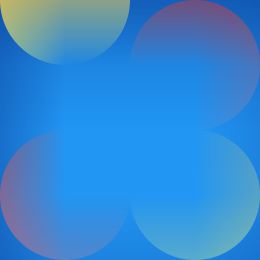

# https://connect-four-in-a-row.web.app/
# Connect Four 🔴 🆚 🟡
An implementation of the game Connect Four. Features include an AI to play against and online multiplayer so you can play with your friends. The game uses React and Redux on the frontend and Socket.IO on the backend.

